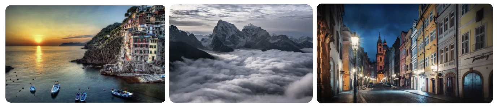
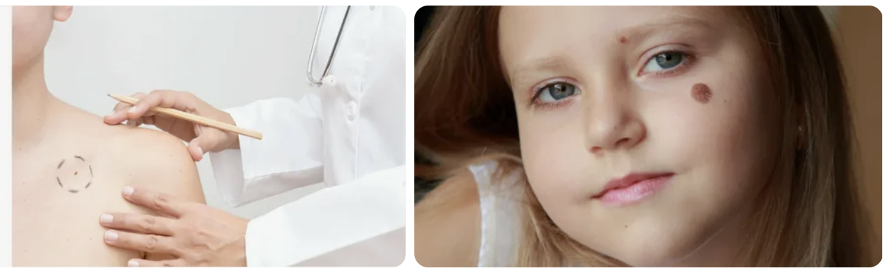
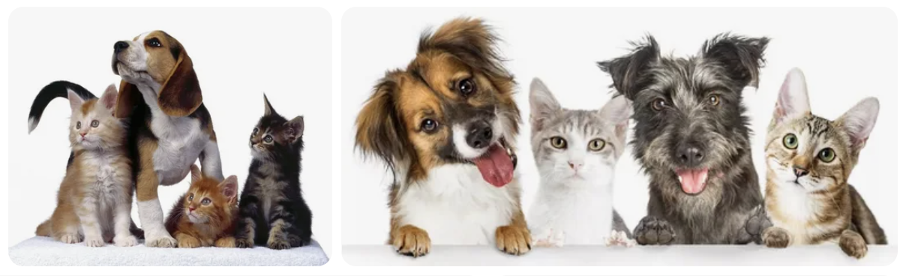

# nn_project_streamlit_app

## Чтобы воспользоваться нашим приложением, перейдите по ссылке [Streamlit](https://nnprojectappapp-qpchksprbxet6mkbgb8eac.streamlit.app/)

### Команда: Анастасия, [Тигран](https://github.com/SoloYolo7)

**Проект:** Приложение "Классификация изображений", на базе Моделей ResNet18 и ResNet50.
### Три части.
* **Распознавание объектов природы**. Приложение на базе модели ResNet50 позволяет определить 6 разновидностей объектов: Здания, Лес, Ледник, Горы, Море, Улица. Данные для обучения модели взяты [Intel Image Classification](https://www.kaggle.com/datasets/puneet6060/intel-image-classification)
  
  
* **Распознавание рака кожи по фотографиям**. Приложение на базе модели ResNet50 позволяет определить Доброкачественный/Злокачественный рак кожи по фотографиям. Данные для обучения модели взяты [Skin Cancer: Malignant vs. Benign](https://www.kaggle.com/datasets/fanconic/skin-cancer-malignant-vs-benign?datasetId=174469&searchQuery=pyt)
  
  
* **Распознавание кошек и собак**. Приложение на базе модели ResNet18 позволяет определить один из двух классов домашнего питомца Кошка/Собака по фотографиям
  
